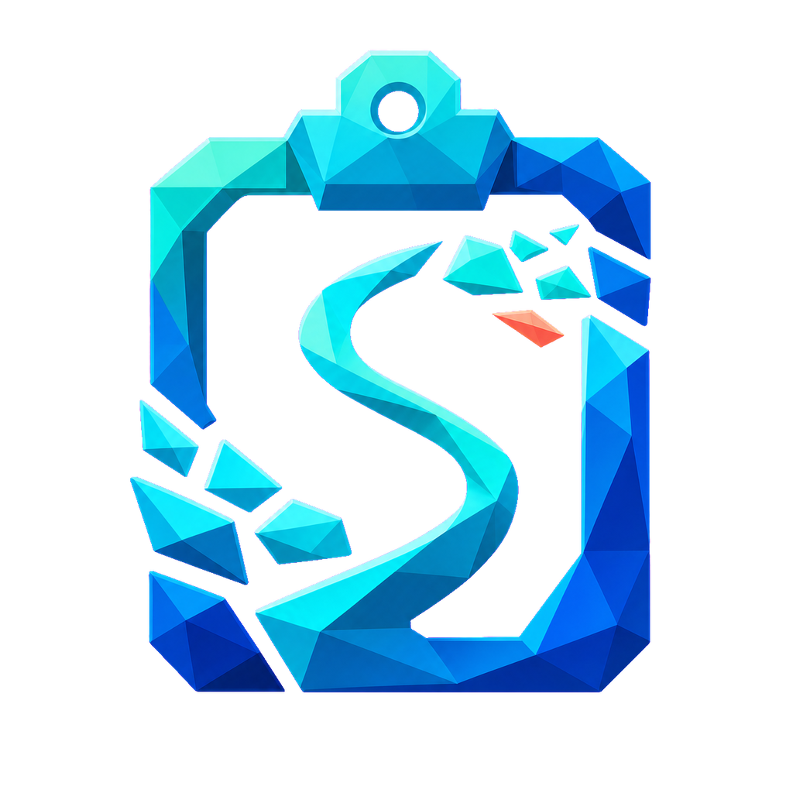

<p align="center">
  
</p>

<h1 align="center">clip-sync</h1>

<p align="center">
  A masterless, encrypted clipboard-history mesh written in Rust.
</p>

<p align="center">
  <strong>Pre-release:</strong> the Linux daily-driver implementation is under real-device validation and has not received an independent security review.
</p>

## Overview

clip-sync synchronizes retained clipboard history between trusted devices without a central service or immediately replacing every peer's active clipboard.

- **No master node.** Every authorized peer stores and forwards retained history.
- **History before interruption.** Remote copies enter a merged history until deliberately activated.
- **Offline reconciliation.** Peers catch up after reconnecting.
- **Interface-scoped networking.** Authenticated discovery and transport run only on explicitly selected Linux interfaces.
- **Encrypted persistence.** SQLCipher stores history metadata and operations; large payloads use fixed-size encrypted chunks.
- **Arbitrary clipboard content.** Text, images, multiple MIME representations, and safe file snapshots are supported.
- **Bounded transfers.** Large shares are chunked, resumable, cancellable, and relayable.
- **Keyboard-first control.** Search, pagination, Vim-style navigation, activation, pinning, deletion, transfers, peers, settings, and diagnostics are available from one desktop window.

The initial target is NixOS on Hyprland/wlroots. Platform boundaries are kept narrow, but other operating systems are not currently supported.

## Architecture

The Rust workspace has five crates with a single lockfile and a strict authority boundary:

- `clip-sync-core` owns domain models, encrypted persistence, clipboard backends, replication, transfer, and transport primitives.
- `clip-sync-ipc` is an independent leaf containing the versioned Protobuf wire contract, bounded framing, and Unix-socket client.
- `clip-sync-daemon` owns discovery, mesh and history orchestration, daemon state, and the IPC server.
- `clip-sync-cli` owns parsing and client/offline command execution without starting a daemon or owning a runtime.
- `clip-sync` is the Tauri package and sole application host, producing the only executable.

The daemon is the sole owner of clipboard access, encrypted storage, retention, transfer state, and mesh networking. The CLI and Tauri desktop communicate with it through an owner-only Unix socket using protocol-v6 Protobuf IPC. They never open storage or mesh state directly, and neither client automatically starts the daemon.

ClipSync sends small HMAC-authenticated UDP multicast beacons on each configured interface. Interfaces that cannot route multicast, including many point-to-point tunnels, fall back to rate-limited authenticated unicast probe windows with a hard per-cycle bound. A valid beacon exposes only the sender address and QUIC port; host and application metadata are exchanged only after the existing mesh-secret-authenticated QUIC handshake succeeds. QUIC listeners bind only to addresses on the selected interfaces, and the Peers view reports only live authenticated connections.

`desktop/` contains the Tauri 2, SvelteKit 2, Svelte 5, Tailwind CSS 4, and shadcn-svelte control window. Rust command signatures generate its TypeScript IPC bindings through Specta.

The desktop history client requests viewport-sized daemon pages, caches the current page plus two pages on each side, and preloads bounded image previews for that window. The preview cache is limited by entry count, memory, and request concurrency.

## Commands

Running `clip-sync` with no arguments launches the desktop window. `clip-sync desktop` is the equivalent explicit form. Start the daemon separately before using desktop or online client commands.

```console
clip-sync
clip-sync desktop
clip-sync daemon
clip-sync status --json
clip-sync peers --json
clip-sync history search 'd:kiwi,t:text,p:false,"error message"' --json
clip-sync history pin <content-id> --json
clip-sync history delete <content-id> --json
clip-sync share-clipboard --confirm --json
clip-sync transfer list --json
clip-sync transfer cancel <transfer-id> --json
clip-sync device forget <node-id> --json
clip-sync config set mesh-quota 1073741824 --json
clip-sync doctor --json
clip-sync rekey --old-key-file OLD --new-key-file NEW
```

History search combines case-insensitive free text with typed filters. Commas and whitespace chain filters conjunctively, while quoted phrases preserve separators. `d:`, `t:`, and `p:` abbreviate `device:`, `type:`, and `pinned:`.

```console
clip-sync history search '"release notes",d:kiwi,t:text,p:true'
clip-sync history search 'before:2026-07-29T12:00:00Z,min-size:4KiB,max-size:2MB'
clip-sync history search 'before:1785326400000'
```

`before:` accepts RFC 3339 or Unix milliseconds. Inclusive size bounds accept bytes, `KB`, `KiB`, `MB`, `MiB`, `GB`, and `GiB`.

## Desktop development

Enter the development shell before building either desktop host. It provides Rust, Bun, WebKitGTK, Wayland, GTK, and the other native dependencies.

```console
nix develop

# Browser-only UI with clearly labeled, non-sensitive sample data
cd desktop
bun install --frozen-lockfile
bun run dev

# Tauri window connected to the running daemon
bun run tauri dev
```

The Tauri script currently runs through XWayland and disables WebKitGTK compositing and DMA-BUF rendering to avoid WebKitGTK/Hyprland rendering failures. The Nix shell and packaged wrapper also expose the GTK/GSettings schema paths required by WebKitGTK. Its production window defaults to `760×520` and supports a `480×300` minimum.

Tauri history shortcuts:

- Arrow keys or `H/J/K/L`: move through the history grid.
- Left/right at a column boundary: move to the corresponding row on the adjacent page.
- `Page Up` / `Page Down`: change pages.
- `/`: focus search.
- `Enter`: activate the selected record and close the window.
- `R`: refresh history.
- `Escape`: close the window from any focused control.
- Right-click a record: activate, pin/unpin, filter by source, or confirm mesh-wide deletion.

## Development

```console
nix develop
cargo run -p clip-sync --bin clip-sync -- config init
cargo run -p clip-sync --bin clip-sync -- doctor
cargo run -p clip-sync --bin clip-sync -- daemon
# In another shell:
cargo run -p clip-sync --bin clip-sync -- status --json
```

Run the local checks before submitting changes:

```console
cargo fmt --all -- --check
cargo check --workspace --all-targets --all-features --locked
cargo clippy --workspace --all-targets --all-features --locked -- -D warnings
cargo test --workspace --all-targets --all-features --locked
cargo build -p clip-sync --bin clip-sync --locked
cargo audit
cargo deny check
nix flake check

cd desktop
bun install --frozen-lockfile
bun run check
bun run lint
bun run test
bun run build
bun run tauri build
```

GitHub Actions runs the frontend and Rust validation suite on pushes and pull requests. Stable SemVer tags build and publish the unified x86_64 Linux executable, its SHA-256 checksum, release notes from `CHANGELOG.md`, and a Nix release-artifact manifest. Live Wayland and multi-device validation remains manual against isolated test state.

### Development principles

- Preserve masterless behavior; do not introduce a hidden coordinator or privileged peer.
- Keep the daemon authoritative for storage, clipboard, transfer, and mesh state.
- Fail closed on authentication, decryption, permission, or validation failures.
- Stream untrusted payloads and enforce explicit resource bounds.
- Never log clipboard contents, filenames, previews, keys, secrets, or plaintext search queries.
- Keep persistent clipboard content and searchable metadata encrypted.
- Make replicated transitions deterministic, idempotent, and testable under reordering.
- Avoid `unsafe` unless a platform boundary requires it and the invariant is documented.

Focused contributions are welcome. Discuss large changes before implementation, add property or integration coverage for replication changes, and use focused commits with imperative subjects. AI-assisted contributors remain responsible for understanding, testing, licensing, and reviewing submitted code; do not submit generated cryptographic constructions without careful human review.

## Tagged releases

Releases use stable SemVer tags such as `v0.2.0`. Before tagging, update the workspace, frontend, and Tauri versions together and add a matching section to `CHANGELOG.md`.

```console
git tag -s v0.2.0
git push origin v0.2.0
```

The release workflow validates the tag against every version source and publishes `clip-sync-v0.2.0-x86_64-linux.tar.gz`, a checksum, and `nix-release-artifacts.json`. After the release succeeds, manually replace `nix/release-artifacts.json` in the default branch with the generated release asset and commit it. That fixed-output hash enables the prebuilt Nix package without trusting a mutable download.

## NixOS deployment

The flake exports the unified desktop/CLI/daemon package as `packages.<system>.default` and the hardened user-service configuration as `nixosModules.default`. The package contains exactly one executable, `clip-sync`.

When `nix/release-artifacts.json` contains an artifact for the current system and version, the default package downloads that CI-built release and uses `autoPatchelfHook` plus the normal runtime wrapper instead of compiling Rust. Before the post-release manifest is committed, or on systems without a published binary, it safely falls back to the source package. `packages.<system>.source` always remains available for reproducible source builds.

```nix
{
  inputs.clip-sync.url = "github:Fractal-Tess/clip-sync";
  inputs.clip-sync.inputs.nixpkgs.follows = "nixpkgs";

  imports = [ inputs.clip-sync.nixosModules.default ];

  services.clip-sync.enable = true;
}
```

The service reads `%h/.config/clip-sync/config.toml`, starts with `graphical-session.target`, restarts on failure, and uses a `0077` umask. UWSM normally imports `WAYLAND_DISPLAY`; verify it when clipboard capture is unavailable:

```console
systemctl --user show-environment | grep WAYLAND_DISPLAY
```

An explicit `WAYLAND_DISPLAY` is honored. If it is absent, the daemon can recover only when exactly one numbered `wayland-N` socket exists in `XDG_RUNTIME_DIR`.

### Secret provisioning

Provision the same high-entropy 32-byte raw or 64-character hexadecimal mesh secret on every peer. The target must be owned by the desktop user with mode `0400` or `0600`. Stable sops-nix symlinks are supported after descriptor-level target validation.

```nix
sops.secrets.clip_sync_mesh_key = {
  sopsFile = ./secrets.json;
  format = "json";
  owner = "your-user";
  mode = "0400";
};
```

Reference the runtime path in the local configuration:

```toml
[shared]
mesh_quota_bytes = 1073741824
capture_threshold_bytes = 20971520
revision = ""

[local]
mesh_key_file = "/run/secrets/clip_sync_mesh_key"
listen_port = 24892
discovery_interval_seconds = 15
reconcile_interval_seconds = 5
reconnect_min_seconds = 1
reconnect_max_seconds = 60
peer_interfaces = ["eth0", "wt0"]
maximum_explicit_share_bytes = 4294967296
transfer_free_space_reserve_bytes = 67108864
materialization_free_space_reserve_bytes = 8388608
max_concurrent_chunk_streams = 4
```

### Mesh-secret rotation

Stop the daemon and rotate every retained node before deploying the replacement secret as its configured `mesh_key_file`:

```console
systemctl --user stop clip-sync
clip-sync rekey \
  --old-key-file /run/secrets/clip_sync_mesh_key_old \
  --new-key-file /run/secrets/clip_sync_mesh_key_new
```

The command is interruption-safe and idempotent when rerun with the same secrets. Do not delete or edit `history.keyslot` or `history.keyslot.next` during recovery. Deploy the new configured secret only after every node reports a verified rotation. Never use the production secret for smoke tests.

## Security

Clipboard history routinely contains passwords, tokens, private keys, messages, and proprietary data. **Do not use this pre-release for sensitive clipboard contents.** The protocol, cryptographic construction, storage format, and transfer behavior have not received an independent security review.

The current trust model assumes that devices belong to one user, operating systems and the secret manager are trusted, and selected network interfaces are appropriate for peer communication. Discovery beacons are authenticated but not confidential and reveal that a host is listening for ClipSync; unauthenticated beacons are ignored. Every holder of the mesh secret has equal authority to read or mutate retained history. clip-sync does not protect against a compromised authorized peer, compromised desktop session, clipboard-source application behavior, or plaintext while an item is actively exposed to another application.

Report suspected vulnerabilities through GitHub private vulnerability reporting rather than a public issue. Include the affected version, reproduction steps, expected impact, and any time-sensitive disclosure constraints.

## License

MIT © Fractal-Tess. See [LICENSE](LICENSE).
