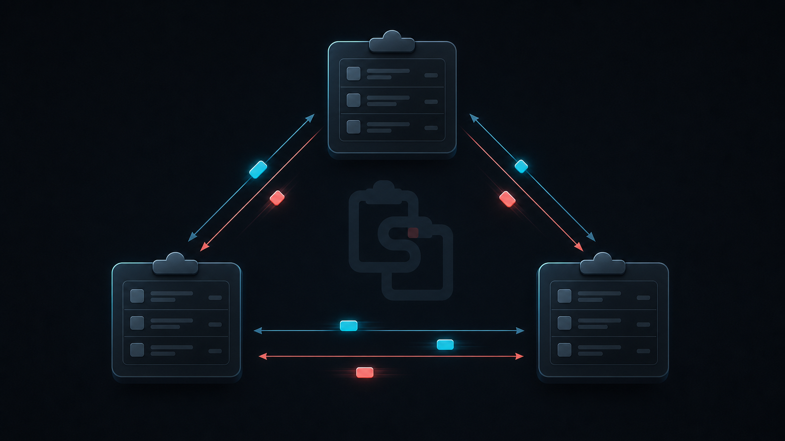

<p align="center">
  
</p>

<h1 align="center">clip-sync</h1>

<p align="center">
  A masterless, encrypted clipboard-history mesh written in Rust.
</p>

<p align="center">
  <strong>Pre-release:</strong> the daily-driver implementation is feature-complete and under real-device validation; it has not received an independent security review.
</p>



## Why clip-sync?

Most clipboard sync tools assume a central service or immediately replace every connected device's clipboard. clip-sync is being built around a different model:

- **No master node.** Every peer stores and forwards retained history.
- **History before interruption.** Remote copies enter a merged history without replacing the active clipboard.
- **Offline reconciliation.** Peers catch up after reconnecting.
- **Private-network first.** The initial transport targets trusted devices connected through NetBird.
- **Encrypted persistence.** Clipboard payloads and searchable metadata are designed to remain encrypted at rest.
- **Keyboard first.** The optional egui switcher provides fast search, grid navigation, pinning, and activation.

## Initial target

The first daily-driver target is NixOS on Hyprland/wlroots, synchronizing two personal devices over NetBird. The architecture keeps clipboard and peer-discovery boundaries narrow so other platforms can be added later.

The current pre-release implements the complete Linux daily-driver path; real-device smoke, deployment, and soak validation remain the release gate.

## Commands

```console
clip-sync daemon
clip-sync ui switcher
clip-sync ui control
clip-sync ui tray
clip-sync status --json
clip-sync peers --json
clip-sync history search 'd:kiwi,t:text,p:false,"error message"' --json
clip-sync history pin <content-id> --json
clip-sync history delete <content-id> --json
clip-sync share-clipboard --confirm --json
clip-sync transfer list --json
clip-sync transfer cancel <transfer-id> --json
clip-sync device forget <node-id> --json
clip-sync config set mesh-quota 1073741824 --json
clip-sync doctor --json
clip-sync rekey --old-key-file OLD --new-key-file NEW
```

The UI commands will only be available when built with the optional `ui` Cargo feature. The switcher uses arrow keys for grid navigation, `Enter` to activate the selected item, `Ctrl+P` to pin or unpin it, and `Esc` to close. Switcher and Control Center dimensions and positions are remembered independently; Hyprland positioning is restored through `hyprctl` because the Wayland protocol does not expose client-controlled placement. The singleton StatusNotifier tray opens the switcher on left click and exposes History Switcher, Control Center, and Quit Tray actions; quitting it does not stop synchronization.

History search combines case-insensitive free text with typed filters. Commas
and whitespace chain filters conjunctively, quoted phrases preserve separators,
and results are always newest first. `d:`, `t:`, and `p:` abbreviate `device:`,
`type:`, and `pinned:`:

```console
clip-sync history search '"release notes",d:kiwi,t:text,p:true'
clip-sync history search 'before:2026-07-29T12:00:00Z,min-size:4KiB,max-size:2MB'
clip-sync history search 'before:1785326400000'
```

`before:` accepts an RFC3339 timestamp or Unix milliseconds. Size bounds are
inclusive and accept bytes or `KB`, `KiB`, `MB`, `MiB`, `GB`, and `GiB`.
Search uses only the daemon's bounded preview and metadata view; the underlying
history remains in the encrypted SQLCipher operation store.

## Status and roadmap

| Phase | Goal | Status |
| --- | --- | --- |
| 0 | Validate Wayland, NetBird, QUIC authentication, encrypted storage, and egui integration | Complete |
| 1 | Project foundation, config, model, IPC, CLI, and local checks | Complete |
| 2 | Encrypted local text history | Complete |
| 3 | Two-node text mesh vertical slice | Complete; disposable live `vd`/`kiwi` NetBird smoke passed |
| 4 | Keyboard-first egui switcher | Complete; live Hyprland shell/singleton smoke passed |
| 5 | Arbitrary MIME and safe file snapshots | Complete in implementation and integration tests |
| 6 | Chunked, cancellable, resumable large sharing | Complete in implementation and integration tests |
| 7 | Retention and convergence hardening | Complete |
| 8 | Full control center and diagnostics | Complete |
| 9 | NixOS daily-driver deployment | In progress |

See [PLAN.md](PLAN.md) for the detailed architecture, threat model, milestones, test strategy, and acceptance criteria.

## Security warning

Clipboard history routinely contains passwords, tokens, private keys, personal messages, and proprietary data. **Do not use the current development version for sensitive clipboard contents.** Security-sensitive behavior will remain clearly marked until the storage and network designs have been independently reviewed and hardened.

The initial trust model uses one high-entropy shared mesh secret supplied through a file (for example, by SOPS). Anyone holding that secret is an equal mesh member and can read or mutate shared history.

Please report vulnerabilities according to [SECURITY.md](SECURITY.md).

## Development

The current implementation includes native Wayland capture/ownership, SQLCipher operation history, envelope rekeying, authenticated NetBird-only QUIC sessions, store-and-forward anti-entropy, encrypted resumable chunks, safe file snapshots/materialization, replicated retention and settings, full CLI/IPC parity, and optional egui switcher/control-center modes. See [the deployment guide](docs/deployment.md), [Milestone 0 findings](docs/milestone-0.md), and [PLAN.md](PLAN.md) for validation details and remaining live soak work.

```console
nix develop
cargo run -- config init
cargo run -- doctor
cargo run -- daemon
# In another shell:
cargo run -- status --json
```

All validation runs locally; the repository intentionally has no hosted CI/CD workflow.

```console
./scripts/check                     # format, daemon/UI builds, clippy, and tests
./scripts/check --security          # also run RustSec and source-policy checks
./scripts/check --nix --security    # also build and validate the Nix packages
WAYLAND_DISPLAY=wayland-1 ./scripts/test-live-wayland
./scripts/deploy-smoke kiwi          # disposable two-node NetBird test
```

The flake exports UI and daemon-only packages plus a hardened NixOS user-service module.

## Contributing

The project is personal-first but intended to become reusable. Design discussion and focused contributions are welcome; read [CONTRIBUTING.md](CONTRIBUTING.md) before opening a pull request.

## License

MIT © Fractal-Tess. See [LICENSE](LICENSE).
