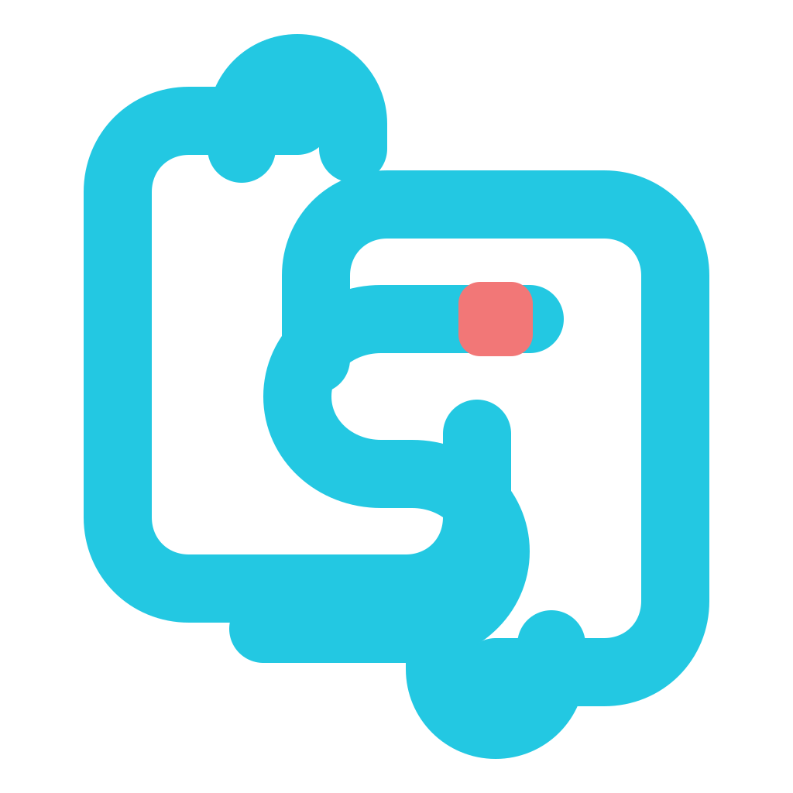

<p align="center">
  
</p>

<h1 align="center">clip-sync</h1>

<p align="center">
  A masterless, encrypted clipboard-history mesh written in Rust.
</p>

<p align="center">
  <strong>Pre-release:</strong> the Linux daily-driver implementation is under real-device validation and has not received an independent security review.
</p>

## Overview

clip-sync synchronizes retained clipboard history between trusted devices without a central service or immediately replacing every peer's active clipboard.

- **No master node.** Every authorized peer stores and forwards retained history.
- **History before interruption.** Remote copies enter a merged history until deliberately activated.
- **Offline reconciliation.** Peers catch up after reconnecting, directly or through any other peer.
- **Large items stay put.** Copied files, and anything over 5 MiB, stay on the host that copied them; another host fetches them from the originals when you paste there.
- **Interface-scoped networking.** Peers are a fixed address list, reached only over explicitly selected Linux interfaces.
- **Encrypted persistence.** SQLCipher stores history under a random per-host key.
- **Arbitrary clipboard content.** Text, images, multiple MIME representations, and files are supported.
- **Keyboard-first picker.** Search, navigation, activation, pinning, and deletion from one window, plus a control centre for peers and diagnostics.

The initial target is NixOS on Hyprland/wlroots. Platform boundaries are kept narrow, but other operating systems are not currently supported.

## Architecture

The Rust workspace has five crates with a single lockfile and a strict authority boundary:

- `clip-sync-core` owns domain models, encrypted persistence, clipboard backends, replication, copied-file handling, and transport primitives.
- `clip-sync-ipc` is an independent leaf containing the versioned Protobuf wire contract, bounded framing, and Unix-socket client.
- `clip-sync-daemon` owns discovery, mesh and history orchestration, daemon state, and the IPC server.
- `clip-sync-cli` owns parsing and client/offline command execution without starting a daemon or owning a runtime.
- `clip-sync-desktop` is the application host, producing the only executable. It renders the picker and control centre with egui on a CPU rasterizer, so the window has no browser engine or GPU dependency.

The daemon is the sole owner of clipboard access, encrypted storage, retention, and mesh networking. The CLI and desktop window communicate with it through an owner-only Unix socket using versioned Protobuf IPC. They never open storage or mesh state directly, and neither client automatically starts the daemon.

Peers are the fixed `peer_addresses` from configuration; nothing is broadcast or probed. QUIC listeners bind only to addresses on the selected `peer_interfaces`, and each peer is dialled from the local address whose network contains it. Every connection authenticates with the mesh secret before any host or history data is exchanged, and the Peers view reports only live authenticated connections.

History is a log of operations every host keeps and relays. Copies up to `inline_limit_bytes` carry their bytes and so exist on every host. Larger copies publish only a description; the copying host records where the bytes are (the original files, or its own store for non-file content) and serves them when another host pastes the item. A file moved or edited after copying is refused rather than served changed.

`crates/desktop` contains both windows. The picker is the default view; `F1` swaps to the control centre, which carries the status, peers, and diagnostics tabs. Image previews are fetched only after the grid is on screen, so decoding never delays the first frame.

## Commands

Running `clip-sync` with no arguments launches the desktop window. `clip-sync desktop` is the equivalent explicit form. Start the daemon separately before using desktop or online client commands.

```console
clip-sync
clip-sync desktop
clip-sync daemon
clip-sync status --json
clip-sync peers --json
clip-sync history search 'release notes' --json
clip-sync history activate <content-id> --json
clip-sync history pin <content-id> --json
clip-sync history delete <content-id> --json
clip-sync device forget <node-id> --json
clip-sync doctor --json
```

History search matches case-insensitive words, all of which must appear in an item's preview, MIME types, or source device.

## Desktop development

Enter the development shell before building the desktop host. It provides Rust, Wayland, and xkbcommon; there is no browser engine or Node toolchain to install.

```console
nix develop
cargo run --bin clip-sync              # picker
cargo run --bin clip-sync -- desktop --control
```

winit and softbuffer `dlopen` Wayland and xkbcommon, so both must be on `LD_LIBRARY_PATH`. The shell and the packaged wrapper set it.

Picker shortcuts:

- Click a history card to activate it and close the window.
- Arrow keys: move through the history grid.
- `Enter`: activate the selected record and close the window.
- `Ctrl+P`: pin or unpin the selected record; pinned records move to the side column.
- `Ctrl+D`: delete the selected record.
- Typing filters; `Escape` closes the window from either view.
- `F1`: swap between the picker and control centre; `Ctrl+Tab` cycles control-centre tabs.

## Development

```console
nix develop
cargo run -p clip-sync-desktop --bin clip-sync -- doctor
cargo run -p clip-sync-desktop --bin clip-sync -- daemon
# In another shell:
cargo run -p clip-sync-desktop --bin clip-sync -- status --json
```

Run the local checks before submitting changes:

```console
cargo fmt --all -- --check
cargo check --workspace --all-targets --all-features --locked
cargo clippy --workspace --all-targets --all-features --locked -- -D warnings
cargo test --workspace --all-targets --all-features --locked
cargo build -p clip-sync-desktop --bin clip-sync --locked
cargo audit
cargo deny check
nix flake check
```

GitHub Actions runs the Rust validation suite on pushes and pull requests. Stable SemVer tags build and publish the unified x86_64 Linux executable, its SHA-256 checksum, release notes from `CHANGELOG.md`, and a Nix release-artifact manifest. Live Wayland and multi-device validation remains manual against isolated test state.

### Development principles

- Preserve masterless behavior; do not introduce a hidden coordinator or privileged peer.
- Keep the daemon authoritative for storage, clipboard, and mesh state.
- Fail closed on authentication, decryption, permission, or validation failures.
- Stream untrusted payloads and enforce explicit resource bounds.
- Never log clipboard contents, filenames, previews, keys, secrets, or plaintext search queries.
- Keep persistent clipboard content and searchable metadata encrypted.
- Make replicated transitions deterministic, idempotent, and testable under reordering.
- Avoid `unsafe` unless a platform boundary requires it and the invariant is documented.

Focused contributions are welcome. Discuss large changes before implementation, add property or integration coverage for replication changes, and use focused commits with imperative subjects. AI-assisted contributors remain responsible for understanding, testing, licensing, and reviewing submitted code; do not submit generated cryptographic constructions without careful human review.

## Tagged releases

Releases use stable SemVer tags such as `v0.2.0`. Before tagging, update the workspace version and add a matching section to `CHANGELOG.md`.

```console
git tag -s v0.2.0
git push origin v0.2.0
```

The release workflow validates the tag against the workspace version and publishes `clip-sync-v0.2.0-x86_64-linux.tar.gz`, a checksum, and `nix-release-artifacts.json`. After the release succeeds, manually replace `nix/release-artifacts.json` in the default branch with the generated release asset and commit it. That fixed-output hash enables the prebuilt Nix package without trusting a mutable download.

## NixOS deployment

The flake exports the unified desktop/CLI/daemon package as `packages.<system>.default` and the hardened user-service configuration as `nixosModules.default`. The package contains exactly one executable, `clip-sync`.

When `nix/release-artifacts.json` contains an artifact for the current system and version, the default package downloads that CI-built release and uses `autoPatchelfHook` plus the normal runtime wrapper instead of compiling Rust. Before the post-release manifest is committed, or on systems without a published binary, it safely falls back to the source package. `packages.<system>.source` always remains available for reproducible source builds.

The canonical package name is `packages.<system>.clip-sync` (also available as
`packages.<system>.default`), and `apps.<system>.default` runs the same
`clip-sync` executable.

The NixOS module installs the selected package system-wide and manages a
per-user systemd unit. Its `package` option defaults to the flake's tested
`packages.<system>.clip-sync` output; override it explicitly to pin another
package or version. `configFile = null` is intentional: the service keeps
using the writable `%h/.config/clip-sync/config.toml` file instead of trying to
generate mutable configuration in the Nix store. `autoStart = false` keeps the
unit available for `systemctl --user start clip-sync` without adding a target
dependency. `environment` supplies service environment variables.

For a Home Manager-only installation, import
`inputs.clip-sync.homeManagerModules.default`. It exposes the same
`services.clip-sync` options and defaults `package` to the same tested flake
output, but installs the package and user service in the user's home
configuration rather than system-wide:

```nix
{
  imports = [ inputs.clip-sync.homeManagerModules.default ];

  services.clip-sync = {
    enable = true;
    autoStart = true;
    package = inputs.clip-sync.packages.${pkgs.system}.clip-sync;
  };
}
```

Use the NixOS module for a system-managed service and system-wide CLI
installation; use Home Manager for a per-user package and user-session
service. Both modules retain the writable per-user default config behavior.

```nix
{
  inputs.clip-sync.url = "github:Fractal-Tess/clip-sync";
  inputs.clip-sync.inputs.nixpkgs.follows = "nixpkgs";

  imports = [ inputs.clip-sync.nixosModules.default ];

  services.clip-sync.enable = true;
}
```

The service reads `%h/.config/clip-sync/config.toml`, starts with `graphical-session.target`, restarts on failure, and uses a `0077` umask. UWSM normally imports `WAYLAND_DISPLAY`; verify it when clipboard capture is unavailable:

```console
systemctl --user show-environment | grep WAYLAND_DISPLAY
```

An explicit `WAYLAND_DISPLAY` is honored. If it is absent, the daemon can recover only when exactly one numbered `wayland-N` socket exists in `XDG_RUNTIME_DIR`.

### Secret provisioning

Provision the same high-entropy 32-byte raw or 64-character hexadecimal mesh secret on every peer. The target must be owned by the desktop user with mode `0400` or `0600`. Stable sops-nix symlinks are supported after descriptor-level target validation.

```nix
sops.secrets.clip_sync_mesh_key = {
  sopsFile = ./secrets.json;
  format = "json";
  owner = "your-user";
  mode = "0400";
};
```

Reference the runtime path in the local configuration:

```toml
[local]
mesh_key_file = "/run/secrets/clip_sync_mesh_key"
listen_port = 24892
peer_interfaces = ["wt0"]
peer_addresses = ["100.91.0.2", "100.91.0.3", "100.91.126.8"]
# Copies up to this size replicate to every host; larger ones are fetched on paste.
inline_limit_bytes = 5242880
# The largest non-file copy kept at all. Copied files have no limit.
max_capture_bytes = 536870912
# Once inline history exceeds this, its oldest unpinned items are deleted everywhere.
history_quota_bytes = 1073741824
# Space for items fetched from other hosts; the oldest are evicted first.
fetch_cache_bytes = 10737418240
# false on a headless host: it then only stores and relays history.
clipboard = true
```

Every setting is per host; nothing replicates configuration. A host's own
address may appear in `peer_addresses`, so one list can serve every host.

### Changing the mesh secret

The database key is a random per-host `history.key` beside the database, so
the mesh secret only authenticates peers. To change it, deploy the new secret
to every host and restart their daemons; hosts on different secrets simply
cannot connect until they match. Content IDs are keyed by the mesh secret,
so the same text copied before and after the change appears twice.

## Security

Clipboard history routinely contains passwords, tokens, private keys, messages, and proprietary data. **Do not use this pre-release for sensitive clipboard contents.** The protocol, cryptographic construction, storage format, and fetch behavior have not received an independent security review.

The current trust model assumes that devices belong to one user, operating systems and the secret manager are trusted, and selected network interfaces are appropriate for peer communication. Discovery beacons are authenticated but not confidential and reveal that a host is listening for ClipSync; unauthenticated beacons are ignored. Every holder of the mesh secret has equal authority to read or mutate retained history. clip-sync does not protect against a compromised authorized peer, compromised desktop session, clipboard-source application behavior, or plaintext while an item is actively exposed to another application.

Report suspected vulnerabilities through GitHub private vulnerability reporting rather than a public issue. Include the affected version, reproduction steps, expected impact, and any time-sensitive disclosure constraints.

## License

MIT © Fractal-Tess. See [LICENSE](LICENSE).
